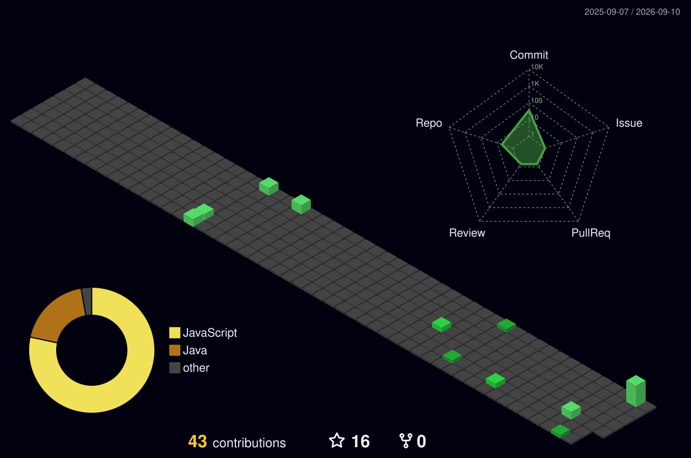

  

<!-- ═══════════════════════════════════════════════════════ -->

## ═══ MISSION LOG ═══

> Projects deployed, contributions made, missions completed.

<table>
<tr>

<td width="33%" valign="top">

### 💰 Tuple Paisa
**Expense & finance tracker** — track spending, manage budgets, and stay on top of your money.

`React` `Node.js` `MongoDB`

[🔗 View Repo](https://github.com/ftharsh/Tuple_paisa)

</td>

<td width="33%" valign="top">

### ♟️ Chess.com Clone
**Real-time multiplayer chess** — built from scratch with live chat system and joinable rooms for playing with friends.

`WebSocket` `Real-time` `Rooms`

[🔗 View Repo](https://github.com/ftharsh/Chess.com)

</td>

<td width="33%" valign="top">

### ✏️ Excalidraw Clone
**Collaborative whiteboard** — rebuilt the drawing experience with custom keyboard shortcuts and zero-lag canvas performance.

`TypeScript` `Performance` `Canvas`

[🔗 View Repo](https://github.com/ftharsh/Excalidraw-Clone)

</td>

</tr>
</table>

<!-- ═══════════════════════════════════════════════════════ -->

## ═══ SYSTEMS ONLINE ═══

> Everything powering this mission.

**Backend**

**Frontend**

**Infrastructure**

**Currently Learning**

<!-- ═══════════════════════════════════════════════════════ -->

## ═══ FLIGHT DATA ═══

> Mission telemetry and trajectory analysis.

  
  &nbsp;&nbsp;
  

  

<!--
  ╔══════════════════════════════════════════════════════════╗
  ║  3D CONTRIBUTION GRAPH SETUP                            ║
  ║                                                         ║
  ║  1. Create .github/workflows/profile-3d.yml             ║
  ║  2. Paste this workflow:                                 ║
  ║                                                         ║
  ║  name: 3D Contribution Graph                            ║
  ║  on:                                                    ║
  ║    schedule:                                             ║
  ║      - cron: "0 6 * * *"                                ║
  ║    workflow_dispatch:                                    ║
  ║  jobs:                                                   ║
  ║    build:                                                ║
  ║      runs-on: ubuntu-latest                              ║
  ║      steps:                                              ║
  ║        - uses: yoshi389111/github-profile-3d-contrib@0.7.1 ║
  ║          env:                                            ║
  ║            GITHUB_TOKEN: ${{ secrets.GITHUB_TOKEN }}     ║
  ║            USERNAME: ftharsh                              ║
  ║        - uses: stefanzweifel/git-auto-commit-action@v4   ║
  ║          with:                                           ║
  ║            commit_message: "generated 3D contribution"   ║
  ║                                                         ║
  ║  3. Run the workflow manually once to generate the SVG  ║
  ╚══════════════════════════════════════════════════════════╝
-->

<!-- ═══════════════════════════════════════════════════════ -->

## ═══ OPEN FREQUENCIES ═══

> Hailing on all channels.

<!-- ═══════════════════════════════════════════════════════ -->

  <code>// Exploring beyond the known horizon</code>

  

